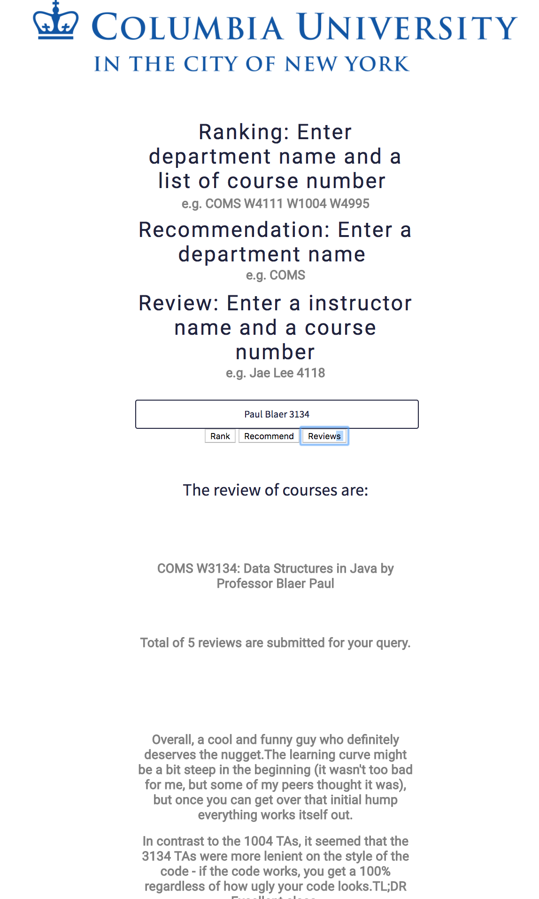
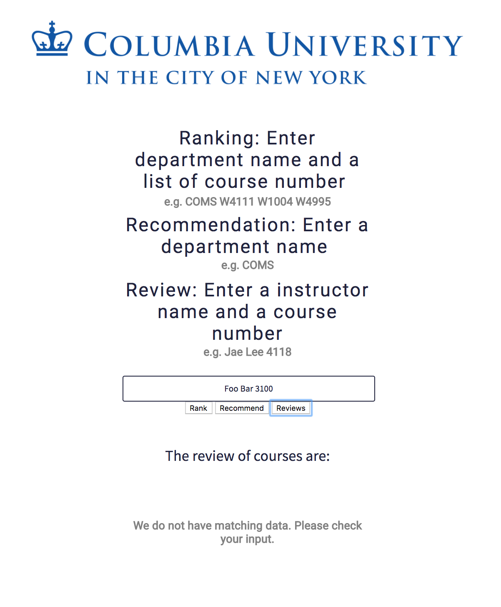

# CU Course Evaluation Service -- MLP
CU Course Evaluation Service -- Machine Learning Product Project

## Project Information

### Team Member
[Jiaqian Chen](https://github.com/Achyles), jc4676;
[TaeYoung Choi](https://github.com/taeyoung-choi), tc2777;
[Zixuan Li](https://github.com/Ironaki), zl2603;
[Zhaoxi Zheng](https://github.com/zhengzhaoxisysu),zz2497

### Bullet Points from the Project Requirements

**Required Services:**
1. More than one service: We have three services: course ranking, course recommendataion and course/professor review
2. Inter-service communication
3. Use github
4. Use JIRA
5. Standups and Retros

**Optional Requirements:**
1. [REST API](./REST_api)
2. [Train](./service) (and use) [Model](./model)
3. Present Data: Now data is used in csv and json file.
4. An event-driven service:
    1. A library shared by at least two services: our services use [web scraping library](./Web_Scraping)
    2. More than one service


### Sprint Plan for the First Iteration

1. Improve UI of the website: [Better UI](./service_example)
2. Improve course recommending service
3. Better inter-service communication: Wrapped up back-end sevices and improved inter-service communication with [React App](./REACT_app)


## Service description

CU Course Evaluation Service is a machine learning product that provides functions of course and professor recommendation, ranking and evaluations for Columbia University student. The data come from [CU Course Directory](http://www.columbia.edu/cu/bulletin/uwb/) and  [CULPA](http://culpa.info/). Currently it provides limited features of recommendation and ranking for Computer Science courses.

## MVP Architecture


## Running services

clone the repository

``` bash
    >> git clone https://github.com/Ironaki/Machine_Learning_Product_Project.git
```

#### Web Scraping 
See the [Web Scraping folder](./Web_Scraping) for information about getting course info from [CU Course Directory](http://www.columbia.edu/cu/bulletin/uwb/) and professor and course reviews from [CULPA](http://culpa.info/). The collected data is stored in csv files in the [data folder](./data).

#### Preprocessing and Training Service

See the [service folder](./service) for the preprocessing and training model service. The result in json format is stored in the [model folder](./model). Preprocessing is done when the server starts to run.

#### Run Services on Webpage

Open Machine_Learning_Product_Project folder in terminal, run:

``` bash
    >> cd React_app/basic_react_dashboard/
    
    >> npm install
    
    >> npm start
```
After the "npm start" command a webpage will be open in a browser.

Open Machine_Learning_Product_Project folder in another terminal, run:

``` bash
    >> cd REST_api/
    
    >> python main_api.py
    
    >> python service_api.py
```

##### Course Ranking Service

With both terminal running, enter the department and course numbers as instructed, e.g. "COMS W1004 W3157 W4118". Hit Rank button. The page will return a ranked list of courses.

##### Course Recommending Service

With both terminal running, enter the department abbreviation , e.g. "COMS". Hit Recommend button. The page will return a ranked list of recommended courses.

##### Course Review Service

With both terminal running, enter the professor name and the course number as instructed. As long as there is a space between first and last name, the order of them does not matter, e.g. "John Doe+2024" or "Doe John+2024". Hit Review button. The page will return the top three key sentences from all reviews for the course and professor.

The list of professors and courses are gathered from [culpa](http://culpa.info/). For this MVP, we have built the service for Computer Science and Statistics departments.

**Example:**


**Example (not in database):**



(Note: the ranking and recommendation services is currently only working with the CS department (COMS). The review service works on any data existed in the database.
The service currently runs on collected and pre-trained data. We may implement a service to collect and train data when user inputs data.)

## Progress and Sprint Plan

#### What we have done so far:

1. Data mining from CULPA and CU directory
2. Building word embedding model
3. Implementing model training services for course and professor rating
4. Implementing course evaluation service based on trained models
5. Building REST API for services with tornado
6. Building React APP


#### Technical Debts

1. CULPA data department unspecified
2. Course section ignored
3. Professor name approximate match
4. Import from preprocess
5. Used Google NLP API rather than designing our own

#### Possible Improvement in the Future

1. Improve file structure
2. Improve training algorithm and evaluating algorithm
3. Make interactive dashboard
4. Expand service coverage on courses
